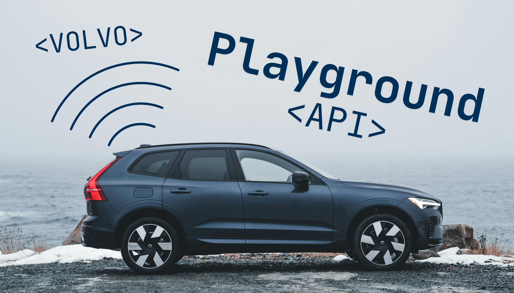

# Volvo-API-playground
This projects aims to provide dynamic alternative to official volvo API sandbox giving developers ways to test every possibility.

> [!WARNING]
> This project is still a work in progress, but it is already in a good state. If you don’t rely on comprehensive documentation, you should find it useful for developing applications for Volvo Connected Vehicles.

## Key features:
- Car that reacts to commands
- Interactive Dashboard
- Additional APIs endpoints for faster manipulating states and forcing errors
- Simplified Oauth 2.0 with PKCE to test your app if it is ready for real API
- Scenarios and snapshots system (WIP, no gui support) 

## Roadmap
- Error logs 
- 2 modes of responses (real life/informative)
- More error testing
- Persistent storage
- Energy and location API

## How to run:
Download the repository.
Packages: fastapi uvicorn pydantic jinja2 python-multipart websockets:
`uv add fastapi uvicorn pydantic jinja2 python-multipart websockets`
then:
`uv run main.py`

### Want to try it out?
You can explore the public instance here:
[Public instance](https://playground.kls.hackclub.app/internal/welcome)

> [!TIP]
> Are you not sure?
> You can check the diffrences in the companion app: [ LINK ](https://compareplay.kls.hackclub.app/)

## Limitations:
- One API key per user. This means one refresh token, one access token, and so on. Because of this, the project cannot accurately reproduce real-world scenarios involving multiple users.(Could be comming in future but it would require using real database)
- No expiration of access token (Usefull?)
- Only one api and Oauth endpoints. More coming in future

## DOCS:
- docs.md file (handwritten with additional info)
- /docs , /redoc and openapi.json (automatic fastapi docs)

# Contributions
When contributing to this project, please keep in mind that it was created for the Hack Club YSWS Stardance event. Contributions that align with the project’s goals and maintain its quality are greatly appreciated even if you don't take part in that event.

## Why created ?
While thinking about new project i thought about recreating volvo app (part of the reason in the hate for it new desing) but while i looked at API I thought its sandbox isn't very good (It could be it is enough for profesional devs but for me not)

## Help needed or BUG found?
Create an issue or contact me on slack

### Connected repository
- [compare app](https://github.com/klswar0/Volvo-api-playground-compare)